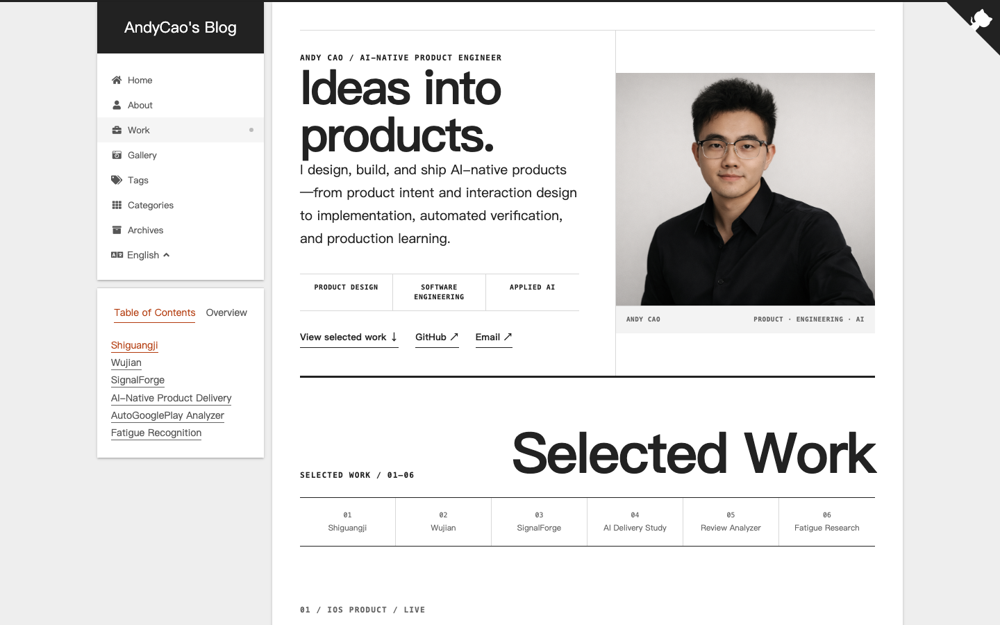
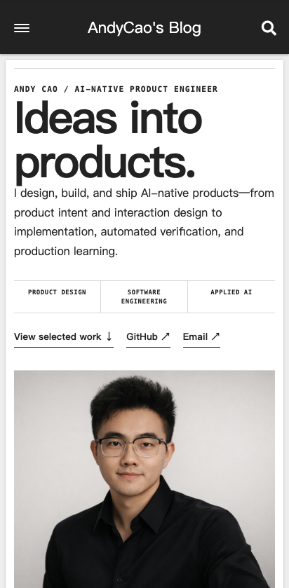
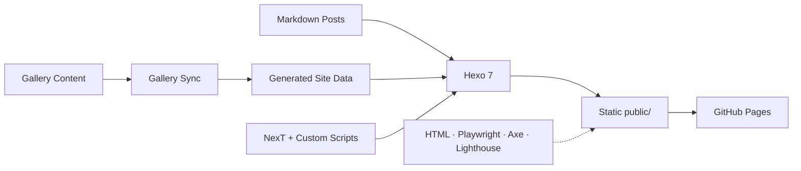

<div align="center">

# Andy Cao — Personal Site & Blog

**A bilingual portfolio, photography gallery, and long-form writing site built with Hexo.**

[Live Site](https://caoyueyang.org) ·
[中文首页](https://caoyueyang.org/zh-CN/) ·
[English Home](https://caoyueyang.org/en/)


</div>

<table>
  <tr>
    <td width="72%">
      
    </td>
    <td width="28%">
      
    </td>
  </tr>
</table>

## About

这个仓库包含 [caoyueyang.org](https://caoyueyang.org) 的站点源码、文章、摄影作品、自定义样式和多语言生成逻辑。站点基于 Hexo 7 与 NexT，中文和英文内容使用严格隔离的首页、归档、标签、分类与文章导航。

除博客内容外，仓库还包括：

- 作品集与摄影 Gallery；
- 中文、英文双语路由和 taxonomy 生成；
- 本地图形化内容维护工具；
- Decap CMS 配置；
- Playwright、HTML Validate、axe 和 Lighthouse 质量门禁；
- GitHub Pages 自动部署。

## Quick Start

需要 Node.js 与 npm。

```bash
npm install
npm run server
```

本地入口：

- <http://localhost:4000/>
- <http://localhost:4000/zh-CN/>
- <http://localhost:4000/en/>

常用命令：

```bash
npm run build          # 生成静态站点
npm run clean          # 清理 Hexo 缓存
npm run test:quality   # 完整质量门禁
npm run cms:local      # 本地图形化内容后台
npm run gallery:sync   # 同步 Gallery 数据
```

## Content Workflow

新建文章：

```bash
npx hexo new "Post title"
```

文章统一存放在 `source/_posts/`，通过 Front Matter 的 `lang` 区分语言：

```yaml
---
title: Post title
date: 2026-07-31 10:00:00
lang: en
description: A concise description
slug: stable-english-slug
---
```

主要规则：

- 中文使用 `lang: zh-CN`，英文使用 `lang: en`；
- 中英文成对文章优先使用相同英文 `slug`；
- `description` 用于首页卡片摘要；
- `photos` 可指定代表性封面图；
- 标签与分类应使用文章对应语言。

完整维护约定见 [站点维护指南](docs/site-maintenance-guide.md)。

## Gallery and CMS

文档驱动的 Gallery 工作流：

1. 编辑 `content/gallery/*.md`；
2. 运行 `npm run gallery:sync`；
3. 检查生成的 `source/_data/gallery.yml`。

本地 CMS：

```bash
npm run cms:local
```

默认入口为 <http://127.0.0.1:4010>。详细说明见[本地 CMS 指南](docs/local-cms-guide.md)。

线上 `/admin/` 已配置 Decap CMS 入口，但启用远程登录前仍需完成对应 Identity 与访问控制配置。

## Architecture



## Quality Gates

```bash
npm run test:site
npm run test:html
npm run test:e2e
npm run test:e2e:cross-browser
npm run test:lighthouse
npm run test:security
```

`npm run test:quality` 会执行构建、Node 测试、HTML 验证、桌面与移动端浏览器测试，以及 Lighthouse 检查。跨浏览器和视觉回归说明见[测试策略](docs/testing-strategy.md)。

## Repository Map

```text
content/gallery/        Gallery 的可维护源数据
source/_posts/          中英文文章
source/images/          站点与文章图片
source/_data/           生成数据和样式覆盖
scripts/                多语言与 Gallery 生成逻辑
tools/local-cms/        本地内容后台
themes/next/            NexT 主题与局部改造
test/                   Node、E2E、可访问性和质量测试
docs/                   维护、测试与迁移文档
```

关键入口：

- [_config.yml](_config.yml)
- [文章模板](scaffolds/post.md)
- [多语言 taxonomy 逻辑](scripts/localized-taxonomy.js)
- [站点维护指南](docs/site-maintenance-guide.md)
- [测试策略](docs/testing-strategy.md)

## Deployment

主部署路径由 [GitHub Actions](.github/workflows/deploy.yml) 管理。手动部署前应先运行：

```bash
npm run test:quality
npm run deploy
```

## License and Content Rights

仓库根目录目前没有统一的开源许可证：

- 文章、摄影作品和原创图片默认保留作者权利；
- NexT 主题及第三方依赖分别遵循各自许可证；
- 未经明确授权，不应假定站点原创代码或内容可自由复制和分发。
