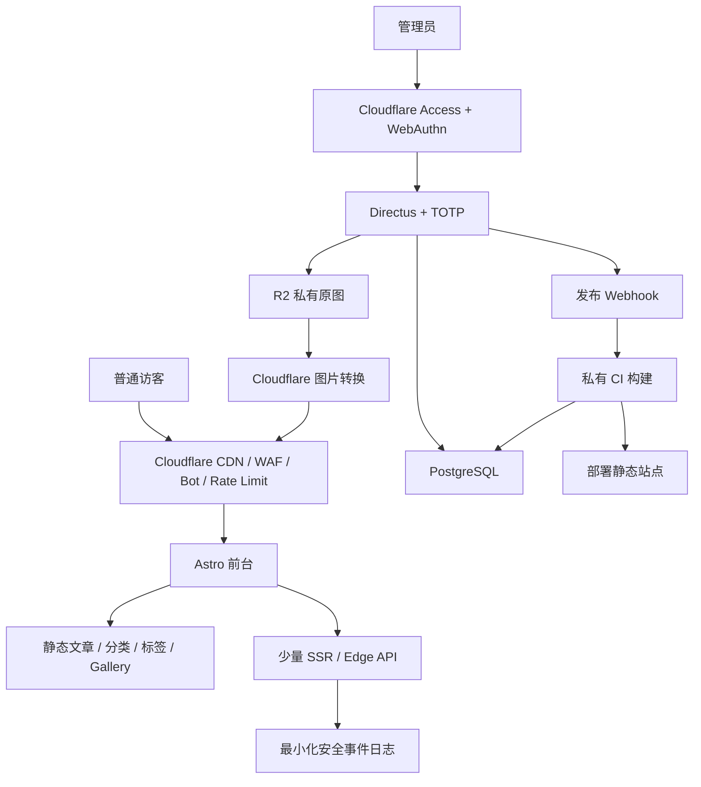

# 博客 Astro + Directus 迁移计划

- 状态：提案基线
- 编制日期：2026-07-30
- 当前站点：Hexo 7 + NexT + GitHub Pages
- 目标站点：Astro + 私有 CMS + PostgreSQL + 私有媒体存储 + Cloudflare 安全层

## 1. 执行摘要

本次迁移不采用在现有 Hexo 代码上原地重写的方式，而采用平行迁移：

1. 现有 Hexo 站点继续对外服务；
2. 在私有仓库和受保护的 Staging 环境中建设新站；
3. 先完成内容、URL、SEO、后台、图片和安全能力迁移；
4. 通过完整自动化和人工验收后切换域名；
5. 架构稳定后，再上线高级动效与 WebGL 等视觉升级。

迁移后的核心形态为：

```text
Astro 静态前台
+ Directus 私有管理后台
+ PostgreSQL 内容数据库
+ Cloudflare R2/Images 图片管线
+ Cloudflare Access/WAF/Bot/Rate Limit
```

公开文章仍以静态 HTML 交付。登录管理、草稿预览、私人内容、签名图片和安全事件由少量服务端或边缘接口处理。

## 2. 背景与当前基线

当前仓库采用内容驱动的静态多页站点架构：

```text
Markdown / YAML / 图片
  -> Hexo
  -> 自定义多语言生成逻辑
  -> NexT 模板与 Stylus
  -> 静态 HTML/CSS/JS
  -> GitHub Pages
```

截至本文编制时，当前内容规模约为：

| 内容 | 数量或规模 |
|---|---:|
| 双语 Markdown 文章文件 | 48 |
| 画廊内容文档 | 28 |
| 画廊图片文件 | 253 |
| `source/images` | 约 276 MB |
| `source/images/gallery` | 约 160 MB |
| 全局 Stylus 覆盖 | 约 2,341 行 |

当前系统已经具备较完整的质量门禁，包括：

- 静态构建测试；
- 双语路由与 taxonomy 契约测试；
- HTML 校验；
- Playwright 桌面端和移动端测试；
- 无障碍检查；
- Lighthouse 性能与 SEO 检查；
- 视觉回归能力。

现状和风险的详细证据见：

- [当前架构](./codebase/ARCHITECTURE.md)
- [当前关注项与迁移准备度](./codebase/CONCERNS.md)
- [测试策略](./testing-strategy.md)

## 3. 迁移目标

### 3.1 产品目标

- 可以通过浏览器登录后台维护文章、页面和相册；
- 支持草稿、预览、发布、修订和回滚；
- 中文和英文内容具有明确的关联关系；
- 正文、草稿、原图和内容历史不再存放于公开 GitHub；
- 支持摄影相册和未来 PhotographHK 复用同一内容平台；
- 保持或改善当前 SEO、性能、无障碍和双语体验；
- 为高级页面动效、Gallery 动画和 WebGL 留出清晰边界。

### 3.2 安全目标

- CMS 管理后台不直接暴露给未授权访客；
- 管理员使用 Passkey/WebAuthn 和 TOTP 两层认证；
- 数据库和原始图片不开放公网；
- Public Role 默认无内容管理权限；
- 浏览器端不包含 CMS 管理 Token；
- 只为安全和反滥用目的记录必要的 IP 信息；
- 支持 WAF、Bot 检测、限流、Turnstile 和图片防盗链；
- 数据库、CMS 配置和媒体具有可验证的备份与恢复流程。

### 3.3 工程目标

- 内容与展示解耦；
- 前台默认静态生成；
- 少量动态需求采用 Astro SSR 或 Cloudflare Worker；
- CMS 响应在进入页面层前完成运行时 Schema 校验；
- 保留旧 URL 或提供明确的永久重定向；
- 新旧站可以平行验证并快速回滚；
- 不把框架迁移、内容迁移、图片迁移和视觉大改一次性上线。

## 4. 非目标

第一阶段明确不做：

- Kubernetes；
- 微服务拆分；
- 自研身份认证；
- 自研 Passkey/WebAuthn 协议；
- 全站每次请求实时查询数据库；
- 将所有页面改成 React SPA；
- 公开评论和访客账号系统；
- 全量保存所有普通访客的原始 IP；
- 在迁移期间同时维护 Hexo 和 Directus 两套内容事实源；
- 在 Release 1 中大规模引入 Three.js 或全站 WebGL。

## 5. 核心架构原则

### 5.1 平行迁移

旧站继续服务，新站在私有 Staging 中构建和验证。禁止在生产 Hexo 站中边拆边换框架。

### 5.2 URL 和内容优先

现有公开 URL、双语关联、发布日期、分类、标签、RSS 和站内链接属于迁移契约。框架实现必须服从这些契约。

### 5.3 CMS 是内容事实源

迁移完成后：

- PostgreSQL 保存正文和结构化内容；
- R2 保存原始媒体；
- Git 保存代码、Schema、迁移和测试；
- 生成的静态站点保存发布结果。

### 5.4 静态优先

文章、分类、标签、归档、About、Work、RSS、Sitemap 和公开 Gallery 默认静态生成。

只有草稿预览、私人内容、联系表单、签名图片和安全事件需要动态执行。

### 5.5 原图私有

公开页面只使用受控尺寸的展示版本。原图不能通过可猜测的公开 URL 直接下载。

### 5.6 安全默认拒绝

未明确开放的 CMS Collection、API、媒体和管理路径均默认拒绝。

## 6. 目标系统架构



## 7. 技术选型

| 层级 | 选择 | 说明 |
|---|---|---|
| 前台 | Astro 7 + TypeScript strict | 内容型站点、静态优先、局部 Islands |
| 样式 | 原生现代 CSS + Astro Scoped CSS | Design Tokens、CSS Layers、Container Queries |
| CMS | Directus | 后台、权限、TOTP、修订、审计和媒体管理 |
| 数据库 | PostgreSQL | 双语关联、taxonomy、相册和未来扩展 |
| 运行时校验 | Zod 或 Valibot | 校验 CMS 和边缘接口返回值 |
| 图片存储 | Cloudflare R2 | 私有原图和可控媒体访问 |
| 图片处理 | Cloudflare Images/Transformations | AVIF/WebP、响应式尺寸、缓存 |
| 边缘接口 | Cloudflare Workers | 表单、签名 URL、预览和安全事件 |
| 搜索 | Pagefind | 构建期静态索引 |
| 测试 | Vitest + Playwright + axe + Lighthouse | 单元、浏览器、无障碍和性能 |
| 管理入口 | Cloudflare Access + Directus TOTP | WebAuthn/Passkey 外层，TOTP 内层 |

官方能力参考：

- [Astro 渲染模式](https://docs.astro.build/en/basics/rendering-modes/)
- [Directus SSO](https://docs.directus.io/self-hosted/sso)
- [Directus 安全建议](https://docs.directus.io/use-cases/headless-cms/security)
- [Cloudflare Independent MFA](https://developers.cloudflare.com/cloudflare-one/access-controls/access-settings/independent-mfa/)
- [Cloudflare 图片转换](https://developers.cloudflare.com/images/optimization/transformations/overview/)
- [Cloudflare 私有图片](https://developers.cloudflare.com/images/optimization/hosted-images/serve-private-images/)

## 8. 建议仓库结构

新架构应位于私有仓库中：

```text
apps/
  blog/
    src/
      components/
      layouts/
      pages/
      lib/
      styles/
  edge/

packages/
  content-schema/
  content-client/
  ui/
  security/

infra/
  directus/
  cloudflare/
  database/

migration/
  inventory/
  import-posts/
  import-gallery/
  migrate-images/
  verify-routes/

tests/
  contracts/
  e2e/
  visual/
```

PhotographHK 后续可以作为独立前端加入：

```text
apps/
  blog/
  photographhk/
  edge/
```

两个网站可以共享内容 Schema 和 CMS，但应独立部署、使用独立的只读 Token 和图片 Bucket。

学习平台不得共享本项目的数据库、身份系统、存储或部署账号。

## 9. 内容数据模型

### 9.1 文章主记录

```text
posts
  id
  status
  published_at
  updated_at
  cover_image
  author_id
  category_id
  translations
```

### 9.2 文章翻译

```text
post_translations
  id
  post_id
  locale
  slug
  title
  excerpt
  markdown_body
  seo_title
  seo_description
  canonical_url
```

中文与英文共享一个 `post` 主记录，但每种语言可以拥有独立的：

- 标题；
- slug；
- 摘要；
- Markdown 正文；
- SEO 标题和描述；
- 发布状态；
- canonical。

### 9.3 Taxonomy

```text
categories
category_translations
tags
tag_translations
```

分类和标签必须使用稳定 ID 建立关系，不能依赖显示名称推断跨语言映射。

### 9.4 页面

```text
pages
page_translations
```

用于 About、Work 和其他非文章内容。

### 9.5 Gallery

```text
albums
album_translations
photos
```

建议的照片字段：

```text
photos
  id
  album_id
  original_asset_id
  width
  height
  aspect_ratio
  taken_at
  camera
  lens
  copyright
  focal_point_x
  focal_point_y
  sort_order
  visibility
```

标题、说明和 alt 文本进入翻译记录。GPS 等敏感 EXIF 默认不公开。

### 9.6 Redirect

```text
redirects
  source_path
  target_path
  status_code
  reason
```

所有不可原样保留的旧 URL 必须进入显式重定向清单。

## 10. 前台渲染策略

### 10.1 静态生成

以下内容默认在构建时生成：

- 首页；
- 文章页；
- 分类和标签；
- 归档；
- About；
- Work；
- 公开 Gallery；
- RSS；
- Sitemap；
- Open Graph 页面元数据；
- Pagefind 搜索索引。

### 10.2 动态渲染

以下内容可以使用 Astro SSR 或 Worker：

- 草稿预览；
- 私人文章；
- 私人相册；
- 联系表单；
- 图片签名 URL；
- Webhook；
- 安全事件接口。

### 10.3 CMS 访问边界

公开浏览器不得直接访问带管理权限的 Directus API。

推荐流：

```text
私有 CI
  -> 使用只读 Service Token
  -> 读取 published 内容
  -> 运行 Schema 校验
  -> 生成静态页面
```

Token 只能存在于构建环境或服务端 Secret 中，不能进入浏览器 Bundle。

## 11. CSS 与视觉架构

不直接迁移现有 2,341 行 Stylus 为另一个全局大文件。

建议结构：

```text
src/styles/
  tokens.css
  reset.css
  base.css
  typography.css
  layout.css
  utilities.css

src/components/
  Header.astro
  PostCard.astro
  Gallery.astro
  Lightbox.ts
```

优先使用：

- CSS Custom Properties；
- `@layer`；
- Container Queries；
- CSS Nesting；
- Astro Scoped CSS；
- `prefers-color-scheme`；
- `prefers-reduced-motion`。

Tailwind CSS 不是本次迁移的必选项。若后续确认采用，应在独立设计决策中引入。

## 12. 图片管线

### 12.1 存储分层

```text
R2 私有原图
  -> 受控图片转换
      -> 480px
      -> 960px
      -> 1600px
      -> 2400px
  -> CDN
```

### 12.2 建议预设

| 用途 | 宽度 | 格式 |
|---|---:|---|
| 列表缩略图 | 480px | AVIF/WebP |
| 普通卡片 | 960px | AVIF/WebP |
| 文章大图 | 1600px | AVIF/WebP |
| Gallery 大图 | 2400px | WebP/JPEG |
| 原图 | 原尺寸 | 私有 |

### 12.3 上传处理

每张图片需要：

- 计算 SHA-256；
- 检查重复；
- 读取尺寸；
- 记录宽高比；
- 生成 blur placeholder 或 dominant color；
- 移除 GPS 等敏感 EXIF；
- 保留必要版权字段；
- 写入旧路径到新 Asset ID 的映射；
- 校验上传前后 Hash；
- 为私人图片生成短期签名 URL。

### 12.4 页面交付

页面必须输出：

- `srcset`；
- `sizes`；
- width 和 height；
- 本地化 alt；
- 合理的 lazy loading；
- Hero 图片优先级；
- 不公开原图地址。

## 13. 管理后台安全

### 13.1 登录链路

```text
管理员
  -> Cloudflare Access
  -> WebAuthn / Touch ID / 安全密钥
  -> Directus
  -> 独立强密码
  -> TOTP
  -> 管理后台
```

### 13.2 Cloudflare Access

- CMS 使用独立子域名；
- 只允许明确的管理员邮箱；
- 不允许整个邮箱域名；
- 要求 WebAuthn 安全密钥或系统生物认证；
- 至少注册两个独立认证器；
- 应用会话建议 4 至 8 小时；
- MFA 会话建议 12 至 24 小时。

### 13.3 Directus

- 禁止公开注册；
- 管理员使用独立随机密码；
- 管理员角色强制 TOTP；
- Public Role 默认关闭全部权限；
- 管理员数量保持最少；
- 建立发布专用只读 Service Account；
- 避免在前台使用永不过期的高权限 Static Token；
- 开启强密码策略和登录失败限制；
- 保留管理活动和修订日志；
- 为活动和修订设置明确留存期限。

### 13.4 源站隔离

推荐使用 Cloudflare Tunnel：

```text
Directus 监听私有网络
  -> Cloudflare Tunnel
  -> Cloudflare Access
  -> 管理员
```

必须满足：

- Directus 8055 不开放公网；
- PostgreSQL 5432 不开放公网；
- R2 原图 Bucket 不公开；
- 禁止通过服务器 IP 绕过 Cloudflare；
- SSH 只使用密钥或受控 VPN；
- 生产 Secret 不进入 Git。

### 13.5 恢复

需要准备：

- 两种以上 WebAuthn/Passkey 认证方式；
- 备用硬件安全密钥；
- Cloudflare 备份码；
- TOTP 恢复信息；
- Directus 管理员恢复流程；
- 数据库凭据恢复流程；
- 域名注册商恢复信息；
- 加密数据库和媒体备份。

恢复信息必须进入受保护的密码管理器并保留离线副本。

## 14. IP 日志与隐私

普通页面浏览统计和安全事件日志分开处理。

不建立长期保存全部原始 IP 的访客画像数据库。

建议只记录：

```text
security_events
  occurred_at
  request_id
  ip_hash
  ip_prefix
  country
  asn
  user_agent_family
  path
  event_type
  action
```

事件类型包括：

- `login_failed`；
- `rate_limited`；
- `bot_challenged`；
- `form_rejected`；
- `private_asset_denied`；
- `waf_blocked`。

建议策略：

- 原始 IP 只在确有安全需要时短期保存；
- 基线保留期建议 7 至 30 天；
- 长期数据使用带密钥哈希或截断后的 IP；
- IP 不作为稳定用户 ID；
- 安全日志不向公开前端暴露；
- 在隐私政策中说明用途、范围和保留时间；
- 涉及香港和中国大陆访客时另行完成合规审阅。

## 15. 防爬与反滥用

采用分层防护：

```text
CDN
  -> WAF
  -> Bot 检测
  -> 路径/IP/行为限流
  -> Turnstile
  -> 私有原图和签名 URL
```

重点保护：

- `/auth/*`；
- `/preview/*`；
- `/api/*`；
- `/contact`；
- `/images/full/*`；
- CMS 和 Webhook；
- 高频遍历分页、标签、归档和 Gallery 的请求。

以下措施不能作为安全边界：

- 禁止右键；
- 前端 JavaScript 混淆；
- 图片透明遮罩；
- 隐藏后台路径；
- 只依赖 `robots.txt`；
- 只依赖 `noai` 标记。

公开 HTML 和公开展示图片无法彻底防止复制。高价值图片的真正保护方式是：

- 原图私有；
- 控制展示分辨率；
- 水印；
- 防盗链；
- 签名下载；
- 访问频率限制。

## 16. 迁移阶段

### 阶段 0：确认决策

需要确认：

- 旧 URL 是否全部永久兼容；
- Directus 和 PostgreSQL 的实际托管位置；
- CMS 使用托管服务还是自托管容器；
- IP 安全日志保留期；
- PhotographHK 是否第一阶段接入同一 CMS；
- 新站首发是否保持现有视觉，还是允许有限改版。

阶段闸门：关键决策形成 ADR 或书面确认。

### 阶段 1：冻结迁移基线

任务：

- 导出全部公开 URL；
- 导出文章、语言、slug、日期、分类和标签；
- 导出 Gallery 和图片引用；
- 保存 RSS、Sitemap、canonical 和 hreflang；
- 保存关键页面截图；
- 保存 Lighthouse 和无障碍基线；
- 对现有内容和图片建立 Hash 清单。

产物：

```text
migration/inventory/
  urls.json
  posts.json
  translations.json
  galleries.json
  image-manifest.json
  redirects.json
  visual-baseline/
```

阶段闸门：清单可重复生成，当前站点质量门禁通过。

### 阶段 2：建立私有基础设施

任务：

- 创建私有仓库；
- 建立 Astro 工程；
- 建立 Directus；
- 建立 PostgreSQL；
- 建立 R2 私有 Bucket；
- 配置备份；
- 配置 Cloudflare Access；
- 配置 WebAuthn 和 Directus TOTP；
- 配置 Cloudflare Tunnel 或等价源站隔离。

阶段闸门：CMS 只能由授权管理员访问，数据库和原图不能公网直连。

### 阶段 3：建立 Schema 和导入器

任务：

- 建立文章、翻译、taxonomy、页面、Album、Photo 和 Redirect Schema；
- 编写幂等文章导入器；
- 编写 Gallery 导入器；
- 编写图片迁移器；
- 输出异常和人工复核报告；
- 为 CMS 返回值建立运行时 Schema。

文章导入流：

```text
读取 Front Matter
  -> 识别语言
  -> 按稳定键配对
  -> 创建 Post
  -> 创建 Translation
  -> 建立分类和标签关系
  -> 保留日期和 slug
  -> 输出异常
```

Gallery 导入优先使用 `content/gallery/*.md`，不把生成的 `source/_data/gallery.yml` 作为新系统事实源。

阶段闸门：导入器重复运行不会产生重复内容；所有异常均有明确报告。

### 阶段 4：Astro 功能兼容

实现顺序：

1. 全局 Layout；
2. Header 和 Footer；
3. 文章页；
4. 首页文章流；
5. 分类；
6. 标签；
7. 归档；
8. 双语切换；
9. About；
10. Work；
11. Gallery；
12. RSS 和 Sitemap；
13. Pagefind 搜索；
14. 404 和 Redirect。

阶段闸门：全部旧内容可访问，主要 URL 和 SEO 契约通过。

### 阶段 5：发布链路

发布流：

```text
管理员发布
  -> Directus Webhook
  -> 校验 Webhook Secret
  -> 触发私有 CI
  -> 拉取 published 内容
  -> Schema 校验
  -> Astro 构建
  -> 自动测试
  -> 发布
```

任何质量门禁失败均不得发布。

阶段闸门：草稿不会出现在公开构建中；发布和回滚可以重复演练。

### 阶段 6：图片管线

任务：

- 上传原图；
- 建立 Hash 映射；
- 生成响应式版本；
- 重写文章和 Gallery 引用；
- 配置签名图片；
- 移除敏感 EXIF；
- 建立图片体积和尺寸预算；
- 验证所有图片解码、方向和色彩。

阶段闸门：网页源代码中不存在可直接访问的私有原图地址。

### 阶段 7：安全和生产验证

任务：

- WAF；
- Bot 规则；
- 登录和 API 限流；
- 联系表单 Turnstile；
- CSP；
- HSTS；
- 安全响应头；
- CMS 审计；
- 最小化安全事件日志；
- 数据库恢复演练；
- 媒体恢复演练；
- Secret 扫描；
- 依赖和容器漏洞检查。

阶段闸门：安全检查清单通过，恢复演练有书面记录。

### 阶段 8：私有 Staging

建议使用受 Cloudflare Access 保护的 Staging 域名，例如：

```text
next.caoyueyang.org
```

Staging 必须：

- 阻止未授权访问；
- 阻止搜索引擎收录；
- 使用与生产相近的数据库、图片和边缘配置；
- 可以执行完整发布和回滚演练。

阶段闸门：自动化测试、人工视觉审阅和内容抽查全部通过。

### 阶段 9：最终同步和切换

禁止长期双写 Hexo 和 Directus。

切换流程：

1. 暂停旧站内容发布；
2. 备份旧仓库和现有构建；
3. 重新运行幂等导入器；
4. 导入最后的增量内容；
5. 完整构建；
6. 运行全部测试；
7. 生成数据库和媒体备份；
8. 降低 DNS TTL；
9. 切换域名；
10. 观察错误、404、SEO、性能和安全事件；
11. 稳定后再归档或私有化旧仓库。

阶段闸门：生产稳定并经过预定观察周期。

### 阶段 10：高级视觉

架构迁移稳定后，再加入：

- Astro View Transitions；
- 首页电影式 Hero；
- Scroll Reveal；
- 图片 Shared Element 转场；
- Gallery Lightbox；
- 视差；
- 胶片颗粒；
- GSAP 时间线；
- 少量 Three.js/WebGL。

要求：

- 正文页保持克制；
- 移动端自动降级；
- 支持 `prefers-reduced-motion`；
- WebGL 只在可见时运行；
- 页面隐藏时暂停动画；
- 动效失败时静态内容仍然可用。

## 17. 测试与验收

### 17.1 内容验收

- 48 个现有文章文件全部有迁移结论；
- 所有双语文章关系明确；
- 28 个相册文档全部有迁移结论；
- 253 个画廊图片文件全部有迁移结论；
- 日期、slug、分类、标签和图片引用一致；
- 没有静默跳过的异常；
- Markdown 渲染无未处理脚本或危险 HTML。

### 17.2 路由和 SEO

- 旧 URL 返回 200 或显式 301；
- 无重定向循环；
- canonical 正确；
- hreflang 正确；
- Sitemap 完整；
- RSS 可用；
- Open Graph 正确；
- 404 页面正确；
- 中文和英文 taxonomy 不串语言；
- 文章上一篇/下一篇不跨语言。

### 17.3 图片

- 无缺失图片；
- 图片方向正确；
- width/height 完整；
- `srcset` 和 `sizes` 正确；
- 原图不可公开直连；
- GPS 等敏感元数据不公开；
- 移动端不会加载不必要的大图；
- Gallery 键盘、触摸和缩放可用。

### 17.4 安全

- 未授权用户无法进入 CMS；
- Passkey/WebAuthn 和 TOTP 均已验证；
- 管理员恢复流程可用；
- Directus Public Role 无意外权限；
- 浏览器 Bundle 不包含 CMS Secret；
- 数据库不能公网直连；
- 原图 Bucket 私有；
- 登录限流和 WAF 生效；
- Webhook 校验 Secret；
- 安全日志不泄露 Token、正文或原图 URL；
- 数据库和媒体恢复演练成功。

### 17.5 质量

- TypeScript strict 通过；
- Runtime Schema 测试通过；
- HTML 校验通过；
- Playwright 桌面和移动端通过；
- Chromium、Firefox、WebKit 关键流程通过；
- axe 无阻断级问题；
- Lighthouse 达到批准的预算；
- 关键页面视觉差异经过人工批准；
- 构建具有可重复性。

## 18. 回滚方案

切换前必须保留：

- 旧 Hexo 源码；
- 旧 Hexo 最终构建产物；
- 旧站部署配置；
- 新 CMS 切换前数据库备份；
- R2 媒体清单；
- DNS 切换前记录；
- 一键或明确步骤化的旧站恢复流程。

回滚触发条件包括：

- 大量旧 URL 404；
- 双语路由严重错误；
- CMS 内容丢失；
- 图片大面积缺失；
- 生产构建无法稳定发布；
- 后台认证或恢复失效；
- 严重性能下降；
- 高风险安全配置错误。

回滚只恢复站点流量，不删除新系统数据。问题修复后重新完成阶段闸门。

## 19. 主要风险

| 风险 | 影响 | 缓解 |
|---|---|---|
| 双语 URL 规则跨层 | SEO 和用户书签失效 | URL 清单、契约测试、Redirect 表 |
| NexT 深度定制 | 视觉难以完全复刻 | Release 1 先功能兼容，视觉逐页验收 |
| 全局 Stylus 体积大 | 样式迁移产生回归 | Design Tokens、Scoped CSS、视觉基线 |
| 图片数量和体积 | 上传、引用和性能问题 | Hash 清单、幂等上传、响应式管线 |
| Hexo 与 CMS 双事实源 | 内容冲突和覆盖 | 禁止长期双写，切换前短暂冻结 |
| CMS 暴露公网 | 管理后台攻击面扩大 | Access、WebAuthn、TOTP、Tunnel |
| 高权限 Token 泄露 | 内容和媒体被篡改 | 最小权限、Secret 管理、Token 轮换 |
| 记录过量访客数据 | 隐私与安全风险 | 仅安全事件、最短留存、哈希/截断 |
| 迁移同时大改视觉 | 难以定位回归 | 两个 Release 分开 |

## 20. 工作量估算

| 工作包 | 估算 |
|---|---:|
| CMS、数据库和基础安全 | 2 至 4 个有效开发日 |
| 内容、双语和图片导入 | 3 至 5 个有效开发日 |
| Astro 功能兼容 | 5 至 8 个有效开发日 |
| 测试、SEO、Staging 和切换 | 3 至 5 个有效开发日 |
| 高级视觉与动画 | 额外 4 至 8 个有效开发日 |

Release 1 整体约为 13 至 22 个有效开发日；加入完整视觉升级后约为 17 至 30 个有效开发日。

实际进度取决于：

- 是否要求逐像素复刻 NexT；
- 旧 URL 是否全部原样保留；
- CMS 和数据库托管方式；
- 图片原始质量与元数据情况；
- PhotographHK 是否纳入第一阶段。

## 21. 建议的下一步

按以下顺序启动：

1. 确认旧 URL 兼容策略；
2. 确认新站是否必须保持当前视觉；
3. 选择 Directus/PostgreSQL 托管方式；
4. 创建私有迁移仓库；
5. 实现迁移基线清单生成器；
6. 建立 Directus Schema；
7. 先用 2 篇双语文章和 1 个相册完成试迁移；
8. 验证后台、图片、构建、发布和回滚闭环；
9. 闭环通过后再批量迁移其余内容。

试迁移必须覆盖：

- 一篇普通双语文章；
- 一篇包含多张图片和复杂 Markdown 的双语文章；
- 一个图片数量较多的相册；
- 一个需要保持旧 URL 的页面；
- 一个需要 Redirect 的页面。

只有试迁移完整闭环通过，才进入全量迁移。
