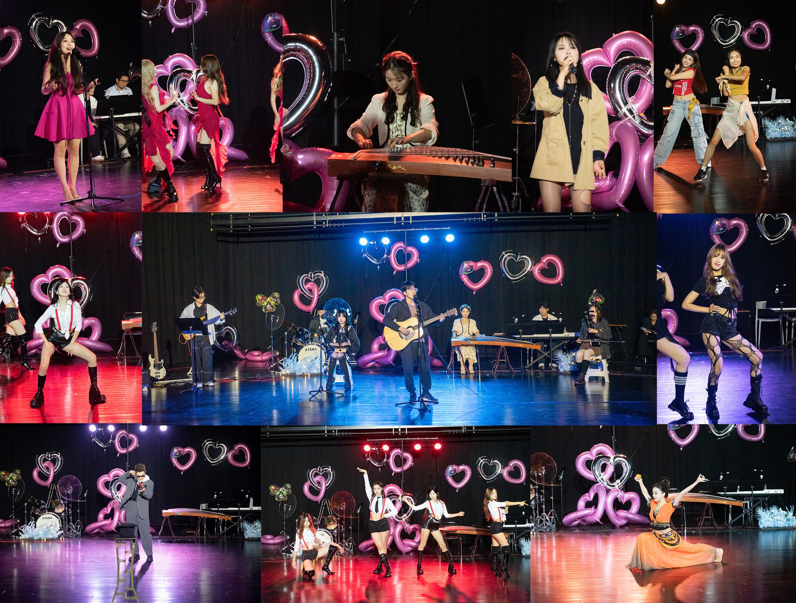

## 前情提要
作为港大研究生会汇声艺术社摄影部（总人数:1人）负责人兼部长兼副部长兼干事（大冰老师：嗯？），也在此次“3.14心跳Π对”演出中贡作为摄影贡献了自己的一份力量。以下是简单的回顾&技术总结，也作为一直想写的关于摄影的文章的开篇。

在3.11之前只知道具体安排是灯光组的辅助，以及在“其余空闲时间你可以从右侧面拍点照片~”（原话），所以其实没有特别正式准备。

携带的设备包括：
> 1. Macbook Air  
> 2. 32GB SD卡 * 2  
> 3. Nikon D5600 + 18-140套机  
> 4. 1230mAh电池 * 2  

其中相机和存储卡自从购入以来已经陪伴我有接近9个年头，作为上个时代的入门级单反，在各个角度上都显得有些落后于时代了。不过好处就是轻便，靠谱，以及长期磨合出来的熟练度。
本来打算带上50 1.8G的小痰盂定焦，不过经验判断是，在狭小的空间与紧凑的表演空余，定焦镜头基本没有应用场景，而且变焦头足够应付绝大多数场景，所以就轻装上阵。

## 场景分析
> 知己知彼 百战不殆 ————《孙子兵法》

表演的场地在庄月明文化中心303剧院，由于经费限制，舞台光线比预计还要差得多。
大约下午两点钟到达场地，有足够的时间进行踩点，并且与负责灯光的同学沟通尽量将面向场地的灯光调亮，以便于给老年机足够的发挥空间。同时与节目负责人沟通，确定了最终拍摄的位置在观众席正面区域最中间的黄金机位。
而本来的工作————辅助灯光也由其他同学负责，所以工作又变成了“拍摄全场照片”（好像上当了？）

这里就不得不说，执行任务的第一条原则：
> 1. **提前到场，计划踩点**

给任务留出冗余的时间，能够更从容地应对突发状况，包括在彩排期间发现存储卡不足以支撑全场拍摄(和其他同学借到了更大容量的TF卡)、电池可能不够用、灯光效果不理想等等，之后拍摄才心里有底，可以对整场拍摄有一个整体的判断和策略。

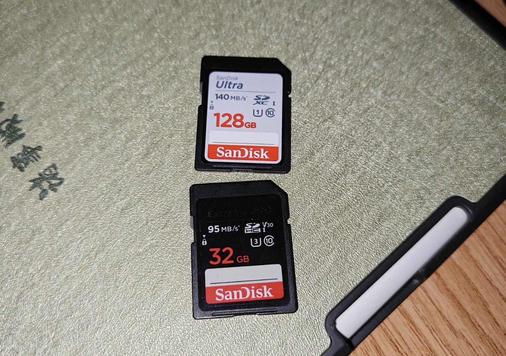

    从其他同学那里借来的TF卡

## 拍摄过程
### 上半场拍摄
在演出前，简单看了一下节目单，绝大部分是舞蹈和歌曲表演。
对于歌曲类动作变化不大的节目，几乎没什么压力，竖构图+横构图拍出曝光正常的照片即可，数量少也方便交差。
但是对于舞蹈类节目，尤其是Kpop群舞，不仅动作样式多、速度快，而且人数众多，叠加上暗光的Debuff，对于CMOS传感器尺寸较小、高感表现较弱、连拍速度不足的APS-C相机来说，无疑是非常大的挑战，所以非常依赖经验和对场景的熟悉度。

个人经验来看，拍摄舞蹈需要注意的是：
1. 开场和结束时，灯光通常较好、动作会保持若干秒的定格，是必须拍摄的“保底时刻”
2. **不患寡而患不均**：如果要拍摄单人特写，尽量确保每个舞者都有至少一张照片，而不是都给C位或者镜头感好的舞者，否则很容易被其他舞者“家长”私信————“老师我们家子涵怎么没有照片？” or “老师你好下头，怎么一直盯着我们家子涵拍？”（~~当然，如果没有利益关系，那就是，爱咋咋拍，尽情表现自己的艺术审美~~）
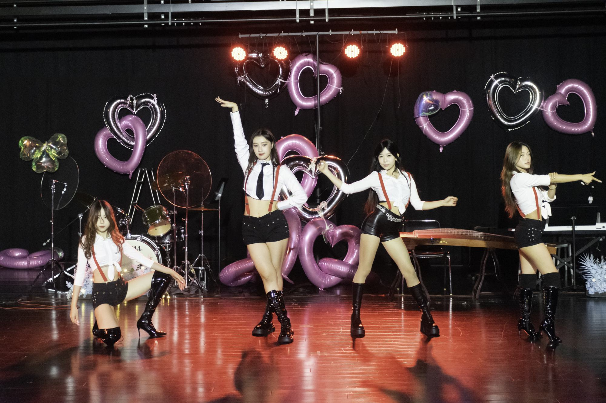

    Kpop群舞

具体的参数和模式选择上，如果设备比较给力，可以选择“快门优先+某一个上限的ISO+最大光圈+高速连拍模式”。
不过我个人还是习惯手动模式，在画面干净度、捕捉瞬间、曝光正常之间取得一个平衡。不过即便如此，实际全程拍摄的感光度也大多在8000上下、快门速度也不足以支撑全部的瞬间定格，这就给后期降噪增加了不少的工作量，废片的比例也比较高，在不更换相机或者镜头的情况下，确实是个无解的难题。

这里就不得不引入第二、三个原则：
> 2. **接受不完美**：拍到>废片>>>没拍到  
> 3. **能在前期解决的问题不要留到后期**：前期曝光正常>后期拉高曝光，也让需要快速出图的场景不至于因为后期处理而延误交差。

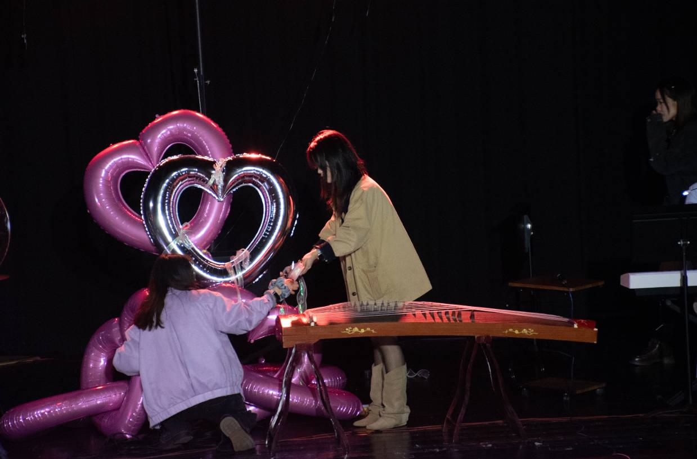

    测试照1:这是一张准备阶段的曝光偏暗的测试照

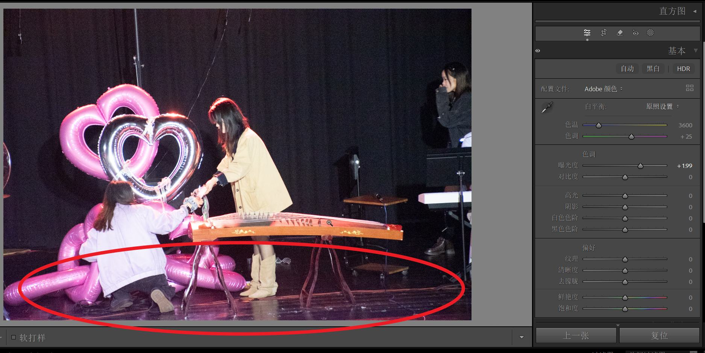

    测试照2:这是后期拉高曝光后的效果

可以看出对比，尤其是在圈出来的本来曝光不足的部分，测试照1的噪点控制明显优于测试照2，所以尽量保证前期曝光正常是十分重要的。

### 下半场拍摄
进入下半场，随着时间推移，观众减少了一些，左手一直在拧变焦环，也有些疲惫，在单眼取景和快速构图之间快速反复地做决策其实对身体和精神都是不小的考验，所以我一直觉得摄影师（尤其是活动摄影师）也是个体力活，这还是在我用非常轻便的设备的情况下，更不用说那些背着大包小包、拿着长枪短炮的更加专业的摄影师了。

***或许这种需要迅速决策、灵活应变的能力，也是AI时代的不可或缺所在吧***

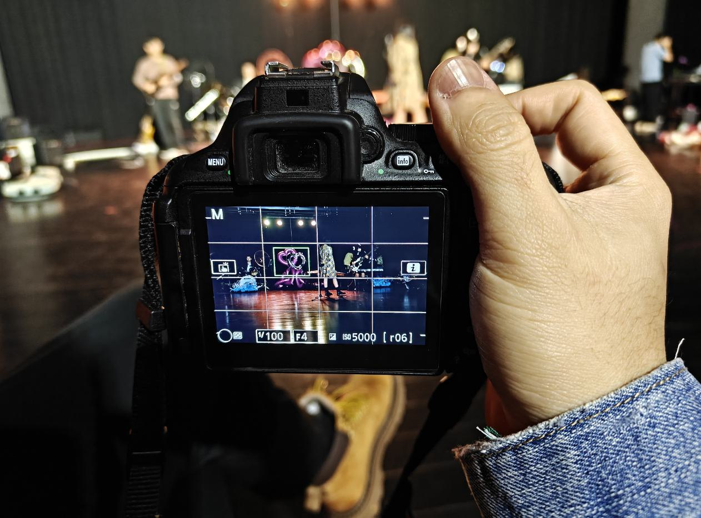

    轻便的D5600

部分观众离开后，摄影师可以移动的空间也越多了，这个时候发现，歌曲节目如果拍摄正面，演出者的面部会被话筒挡住，影响效果，所以果断移动到侧面拍摄。

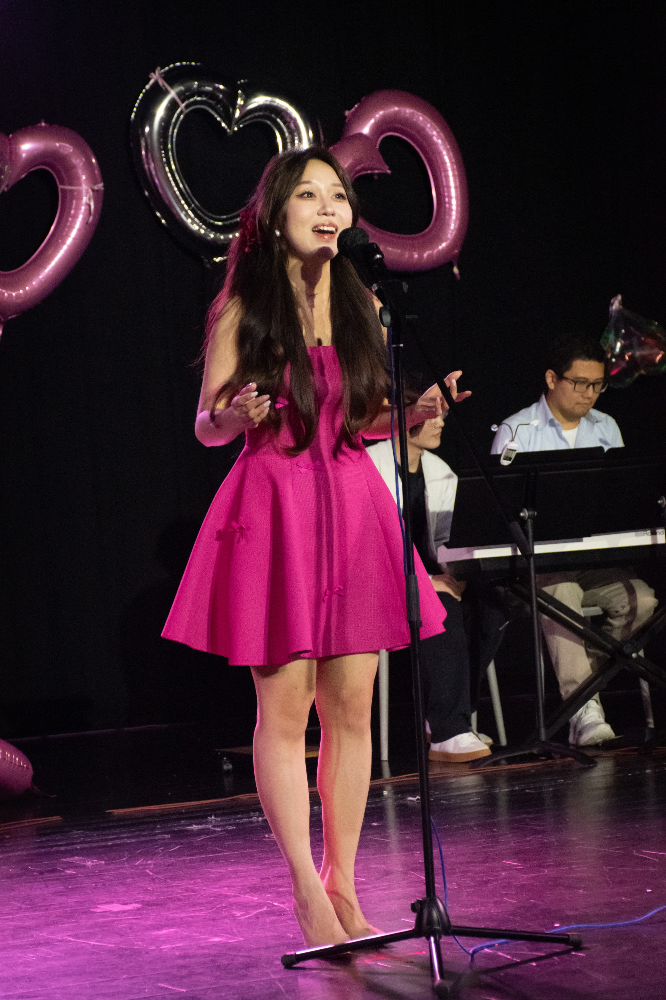

    侧面的歌手视角，虽然话筒的投影依然影响效果，不过比起整个面部被遮挡，已经非常不错了

这里引入第四个原则：
> 4. **保持角色的自我认知**：要记住自己的身份是 ***摄影师aka高权限工作人员***————拿着相机的时候实际上你拥有“隐形人”的特权，观众会下意识忽略或者习惯你的存在，所以大胆地移动，寻找最佳的拍摄角度，而不是畏手畏脚担心打扰到别人，这是很多新手包括笔者本人在早期活动摄影中非常欠缺的意识（当然，请勿做出发出巨大声响、不必要的肢体接触、暴躁地使用闪光灯等行为）

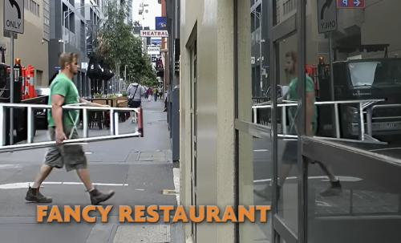

    据说只要你穿着工装、带着梯子，迈出自信的步伐，你可以出入任何场所，包括罗浮宫

### 合照
《乌合之众》里说道

> 个人一旦进入群体，他的个性便会被湮没，群体的思想占据统治地位，而群体的行为表现为无异议、情绪化和低智商。

虽然现场的每个人都是学者、名流、艺术家，但是当他们聚在一起的时候，多少也会表现出群体的特征：等待指令、混乱、无序等。

因此，这个时候作为摄影师，就不得不充当起“临时导演”的角色，需要指挥群众摆出好看的姿势，并且给予适当的鼓励和幽默，来调动现场的气氛。

**一些可以背诵/复读的话术：**
> 1. 好的，大家看镜头，笑一笑
> 2. 三二一看镜头，茄子
> 3. 好看好看，真蚌，再来一张
> 4. 第一排蹲下，第二排半蹲，第三排站直，保持住
> 5. (以及一些冷笑话)

在这个环节，摄影师必须表现地专业，要迅速判断什么位置的光线最好，什么位置的背景最干净，什么位置的构图最合适，并且要大胆指挥大家移动。

这需要一定的协调能力和控场能力，毕竟“公众演讲”被视为人类最恐惧的活动之一：让一群人听从你的指挥，需要声音、神态、动作、语气的自信。

那么怎么才能做到“专业”呢？

还是那句老生常谈的话————"Practice makes perfect"（熟能生巧）。

有类似的机会的话，一定要主动争取，慢慢地就会发现Leadership也上去了。

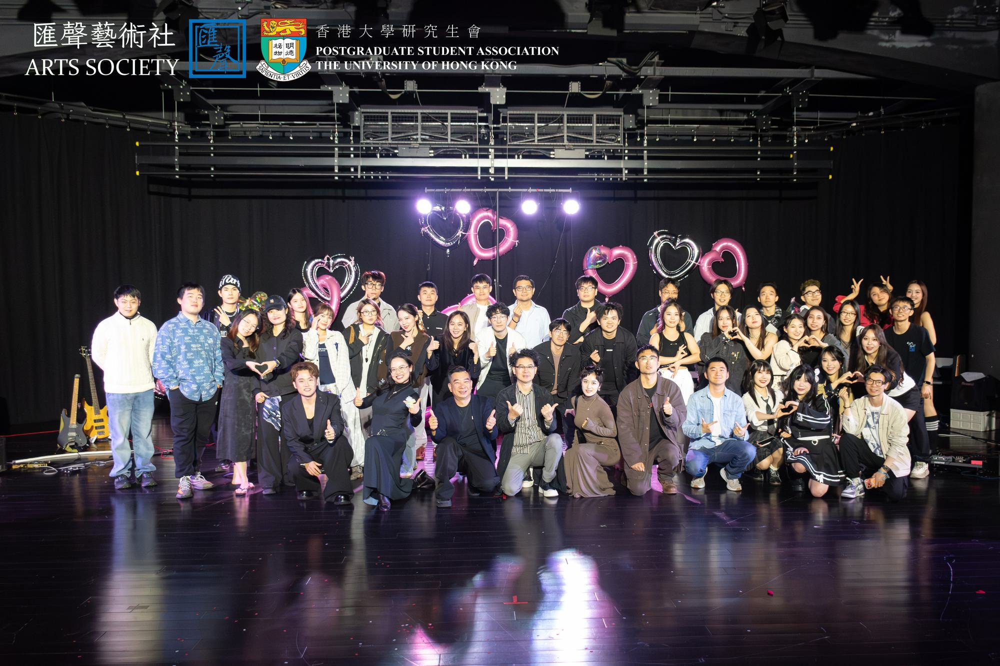

    每个人都会发的合照。摄影师在哪呢？摄影师在照片后面举着相机XD

### 结束后的Social环节
Social环节类似于结束后的饭局，是演出者、工作人员以及观众们互相交流，添加联系方式的大好时机。

如果是纯粹的商业摄影，摄影师在这个环节其实可以离开了，但是也可以主动请缨，看到帅哥美女就主动帮忙拍照，（顺带要个微信发照片），不管是获客还是拓展人脉还是寻找潜在的男女朋友，可谓是自然丝滑如流水。

当然，你要是坚持“老派联络之必要”，和过去的笔者一样，从不参与这个环节，或者除了Email之外什么联系方式也不给，那你是这个👍。

这个时候闪光灯就可以大胆地使用了，如果还有大光圈镜头，那最后拍出来的效果肯定堪比《名利场》杂志，这谁能顶住不发Social Media？

不过一切繁华嘈杂过后，留给摄影师的，只有无尽的修图，以及按时交付照片的压力与责任。

> 如果在数据保存好之前，不小心把存储卡弄丢了/格式化了，那可就真的“人没了”。

## 后期处理
> 摄影作为一门(~~把钱~~)用光的艺术，有人把它和音乐类比：**前期是作曲，后期是演奏**————前期拍摄时，通过调整相机的参数来控制构图和对焦，就像作曲家谱写乐章定下基调；后期处理时，通过调整数码底片的参数来控制影调、风格，通过微调光影来引导观众的视线，就像演奏家通过乐器来表达情感，每一次都独一无二。(·~~AKA凭感觉瞎调~~)

但是哈，作为摄影部唯一的苦力，在这接近三小时的演出里，一共拍摄了3000多张RAW底片，共计110多GB，光是把照片导入电脑就花了不少时间，如果每一张照片都进行艺术处理显然是不现实的。

当天拍摄完毕，凌晨赶车过口岸到家，第二天刚刚睡醒就被催图，紧急修好交出集体照之后，剩下的部分，时间紧任务重，那就不得不上点工业化的手段了————Lightroom批量修图。

### 修图工作流
毕竟任务量过于繁重，所以必须给定一个工作流SOP。
当前我的Lightroom工作流是：导入照片-->定星级初筛-->批量应用镜头矫正等基础调整-->初筛-->二次筛选-->修图(构图调整、局部微调、少量精修)-->降噪-->添加水印-->导出。

其中初筛和二次筛选占据了绝大多数时间，必须剔除：
- 曝光严重不准的照片
- 焦点不准的照片
- 构图不当的照片
- 主体被遮挡的照片
- 面部狰狞/闭眼/表情奇怪的照片
- 同步率过低/动作不协调的照片
- 会暴露表演者身体短板的照片

这时候，对精力和耐心的考验就来了，因为这个工作非常繁琐，而且高度依赖于主观审美，哪怕每张图只用5秒，3000张照片也需要250分钟，也就是4个多小时。而且，高强度集中注意力做判断，本身也是一个非常消耗认知带宽的事，所以到后期基本上已经处于一种半麻木。颇能体验到，哪怕整个画面和演员都非常完美，但是依然会有强烈的索然无味和空虚感。

所以第二次筛选的时候，可能有些实际不错的照片被一瞬间的判断筛掉了，就像很多现实发生的事情一样，显得有些荒谬和草台。

这里就不得不再次提到原则三：
> 3. **能在前期解决的问题不要留到后期**：前期曝光正常>后期拉高曝光，也让需要快速出图的场景不至于因为后期处理而延误交差。

如果前期没有拍摄好，在初筛的时候就会非常影响判断，极大地降低判断速度，而且在修图流程，也会增加很多的工作量，所以说Please Keep in Mind of this Rule。

而在修图的过程中，需要注意的是，确保影调正常的情况下，尽量还原现场的氛围，基本上加一个暗角、把曝光稍微调亮一些、演员的皮肤调白皙一些能够适配绝大多数人的审美。

对皮肤的适当磨皮可以提升照片的观感，但是切记不要过度，否则用户体验会急剧下降。

而美颜如果没有把握，就不要乱动，否则会适得其反。(~~用户自己会P图~~)

### 特殊处理
在所有的照片里，有两张进行了额外的处理。

第一张是最开始乐队的全景合成，因为当时光影非常稳定，而且吉他手即将毕业，是一个非常只得纪念的瞬间，比起广角裁切，全景合成能够更好地保留清晰度和透视关系，所以快速地拍摄了三张照片进行全景合成。

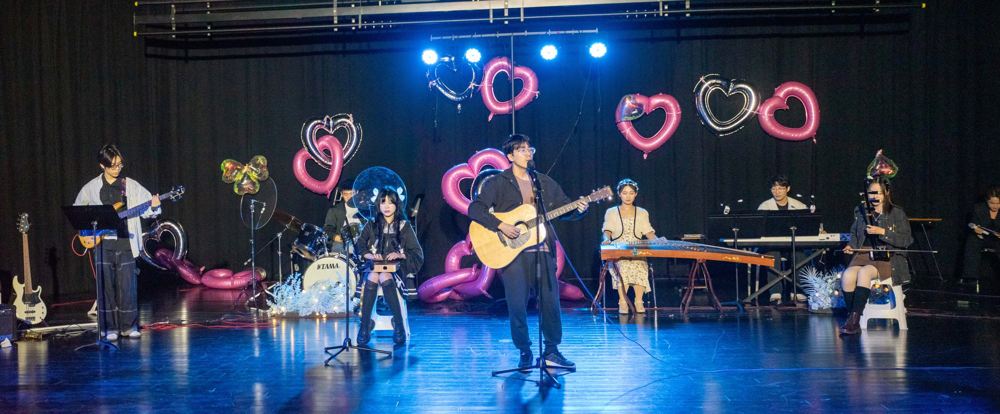

    乐队表演：安和桥&莉莉安 

第二张是Kpop舞蹈的合影，因为拍摄时机和构图的原因，舞者的最佳动作和构图没能在一张图下拍摄下来，而刚好有两张照片各自包含了最佳的动作和构图，所以就进行了拼接。

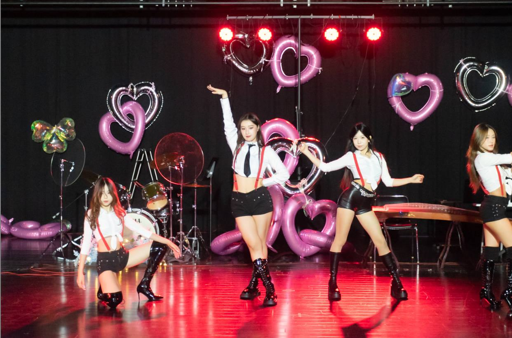

    Expectation期待 cover. Girls' Days -Pic1 动作到位，构图大问题

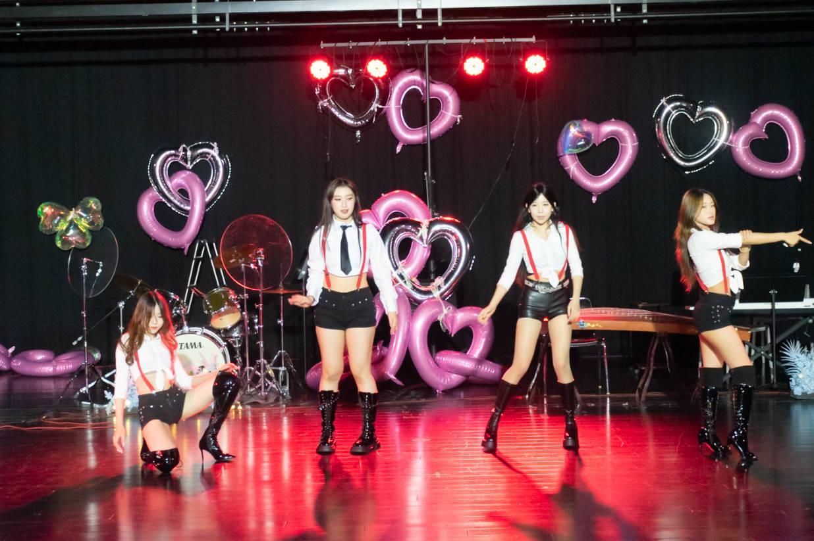

    Expectation期待 cover. Girls' Days -Pic2 构图到位，动作不统一

所以，使用了Photoshop进行拼接。

    如果仔细看的话，会发现其实舞者的光影会有一些诡异的地方。

## 总结
回顾这场 3.14 的拍摄，所谓的“活动摄影师的自我修养”，实际上是**技术、心理与职业道德**的三位一体：

1.  **从器材控到场域掌控者**：修养的第一步是放下对参数的执念，拿起对现场的掌控。从前期踩点的“知己知彼”，到合照环节的“权力指挥”，摄影师必须时刻清楚自己的角色——你不仅在记录，你还在引导。
2.  **在效率与艺术间博弈**：面对 110GB 的数据洪流，修养体现在你如何通过科学的 SOP（算法）去平衡那份属于个人的情怀（演奏）。接受不完美并稳定地产出，是职业化最基本的尊严。
3.  **对影像权力的敬畏**：每一张被剔除的面部狰狞的照片，都是一份温柔。保护表演者的闪光点，守住存储卡里的每一比特数据，这是修养中最为沉默但也最重的一部分。

总之，摄影师绝非仅仅是那个按下快门的“透明人”，而是那个在喧嚣中保持极度冷静、在疲惫中坚守审美底线的独行侠。

## 后记
在社交媒体和AI的时代，传播的价值往往大于内容本身，现在的世界似乎真的就是“不说等于没有做过”，这让很多向我一样非常在乎隐私的人感觉有些难以适从，也在学着尝试做包装和主动宣传。Just like:“不想把世界拱手让给自己鄙视的人。”

不过坚持做原创、精品，追求卓越的精神始终如一，这也是未来会一直坚持下去的事情。

从做Helper到最后云盘交付出图，一共高强度工作了几乎21个小时，几乎整个周末的时间都花在这上面了，而且真的Literally一个人在战斗，没有任何人帮忙，而且没有人有期待，一切都是自己对自己的要求，我的要求也只是希望在照片上面额外加一个小的我的水印而已，从投资回报率来看，这是一个纯粹ROI为负数的事情。
（即便这样，也还是看到照片的水印被截掉，多少有些心塞，或许找我要无水印原图or用AI消除是一个更好的解决方案。）

初次体验了皇岗口岸过关，以及凌晨打车困难的窘境，辛苦但是新鲜，也认识了不少新的朋友，这对人生体验确实是一种正面的扩充。

在结束之后看到了大家在社交媒体上分享的照片，以及收获了大家的感谢，还是非常开心的。

感触很深的是看到老同学、现任社长的发文同时配上的感触：疲惫、压力、为爱发电，总归是有些共鸣的。我始终觉得“用爱发电”不是一个好词，它代表着纯粹、自由，但又常常伴随着牺牲和不被尊重，以及没有持久的活力，但是这也是学生社团的伟大和精神凝聚所在。

如同茶道所说的“一期一会”，这个周末，3000 次快门，500 张成片，是我给这场相遇最高的礼遇。

舞台终会有相遇和散场，但是，记忆里的热烈、冲动和汗水，会永远定格在这一刻，这也是我喜欢摄影的原因。